

  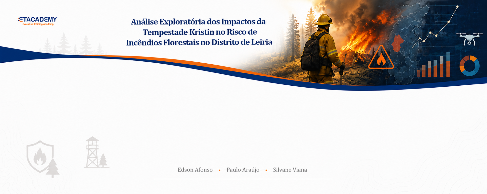

# Projeto_EDA_Leiria-
Análise exploratória e preditiva do impacto ambiental da Tempestade Kristin e do risco de incêndios florestais no distrito de Leiria. 

## Índice
- Introdução
- Objetivo
- Desenvolvimento
- Outputs
- Análise Preditiva
- Conclusão

## Tecnologias utilizadas
Python
| Pandas
| Matplotlib
| Seaborn
| Streamlit
| Spyder
| GitHub

<h2>Introdução</h2>

</h6>
Nos últimos anos, Portugal tem enfrentado um aumento significativo de fenómenos climáticos extremos, incluindo 
tempestades intensas e incêndios florestais de grande dimensão. A Tempestade Kristin provocou diversos danos 
no distrito de Leiria, nomeadamente a queda de árvores, destruição de áreas florestais e acumulação de matéria vegetal seca. 
Estes fatores podem contribuir diretamente para o aumento do risco de incêndios, especialmente durante períodos de temperaturas 
elevadas e baixa humidade.
A análise exploratória de dados surge como uma ferramenta importante para identificar padrões, relações e fatores de risco 
associados a estes fenómenos ambientais, permitindo compreender melhor os impactos causados e apoiar estratégias de prevenção.
</h6>

---

## Objetivo

O principal objetivo deste projeto é analisar a relação entre a queda de árvores causada pela Tempestade Kristin e o aumento do 
risco de incêndios florestais na área compreendida de Leiria, Marinha Grande e áreas costeiras, e municípios adjacentes.
Pretende-se explorar dados meteorológicos, ambientais e florestais para identificar padrões de vulnerabilidade 
e possíveis fatores que favorecem a propagação de incêndios.

---

## Desenvolvimento

Para o desenvolvimento deste estudo serão utilizados dados provenientes de entidades oficiais, como o IPMA, ICNF e 
Autoridade Nacional de Emergência e Proteção Civil. Serão analisadas variáveis como temperatura, número de árvores caídas, 
vegetação seca e ocorrências de incêndios florestais.

Através de técnicas de análise exploratória de dados, como gráficos estatísticos, mapas geográficos, correlações e séries temporais, 
será possível identificar áreas mais vulneráveis e compreender como os resíduos florestais resultantes da tempestade podem atuar como 
combustível para incêndios futuros.

Além disso, será proposta uma abordagem preventiva baseada nos resultados obtidos, destacando medidas de limpeza florestal, 
monitorização ambiental e gestão de risco.

---

## Análise de Dados

A análise de dados será desenvolvida com recurso a ferramentas de Data Science e visualização interativa, 
permitindo interpretar padrões climáticos e ambientais associados ao risco de incêndios florestais.

Serão utilizados gráficos estatísticos, dashboards, e técnicas de análise preditiva para compreender a relação 
entre temperatura, seca, humidade, área ardida e vulnerabilidade florestal na área supracitada.

O projeto pretende ainda desenvolver uma abordagem inteligente de monitorização e prevenção, contribuindo para a 
identificação de períodos críticos e apoio à tomada de decisão em contexto de risco ambiental.

---
## Resultados

## KPIs - Área Ardida (Maio a Outubro 2025)

  ---
  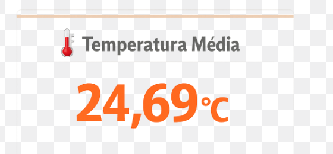

  ---
  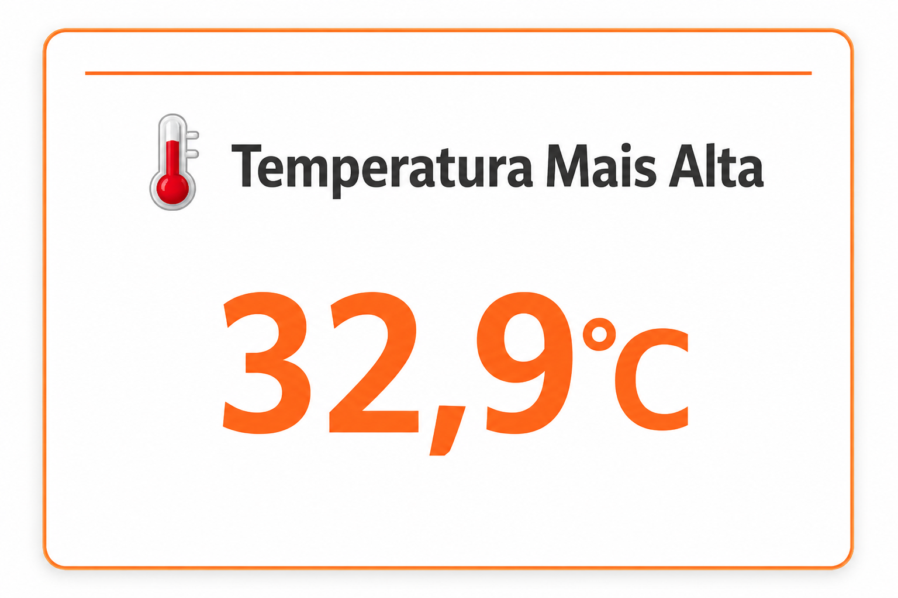

  ---
  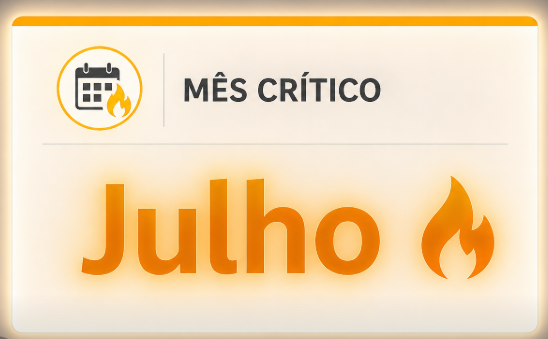
  

---

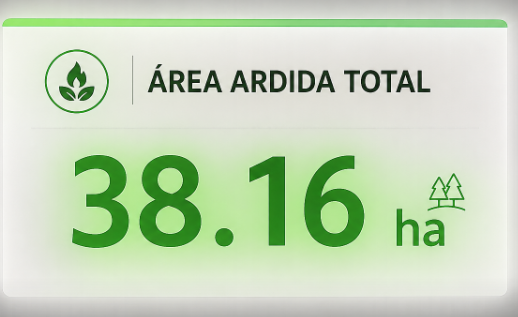

---
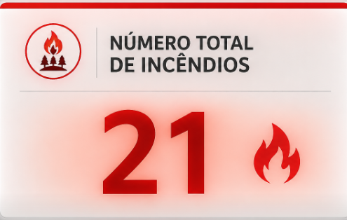

---

  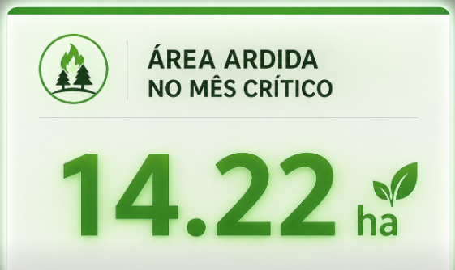
  

---

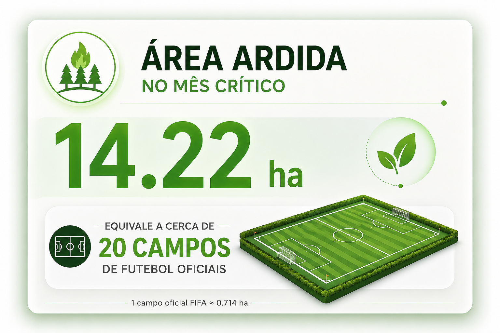

---

1) 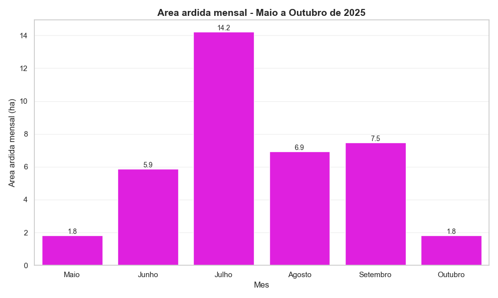

---

2) 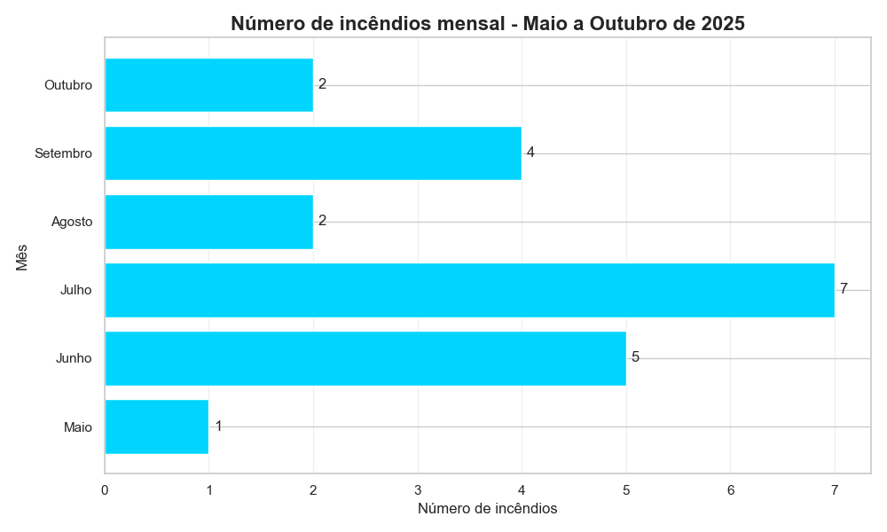

O gráfico demonstra a evolução mensal da área ardida entre Maio e Outubro de 2025, evidenciando aumento 
significativo durante os meses de verão, especialmente em Julho, período identificado como o mais crítico da análise.

---

3) 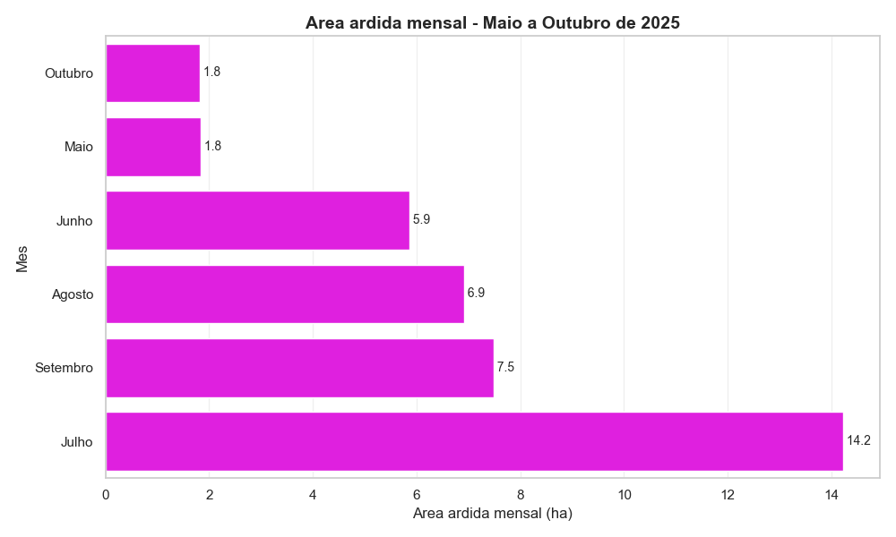

---

4) 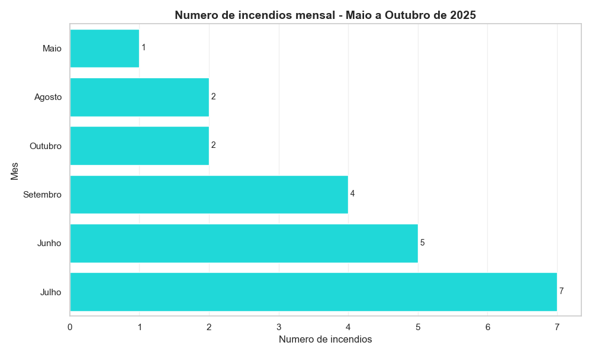

---

5) 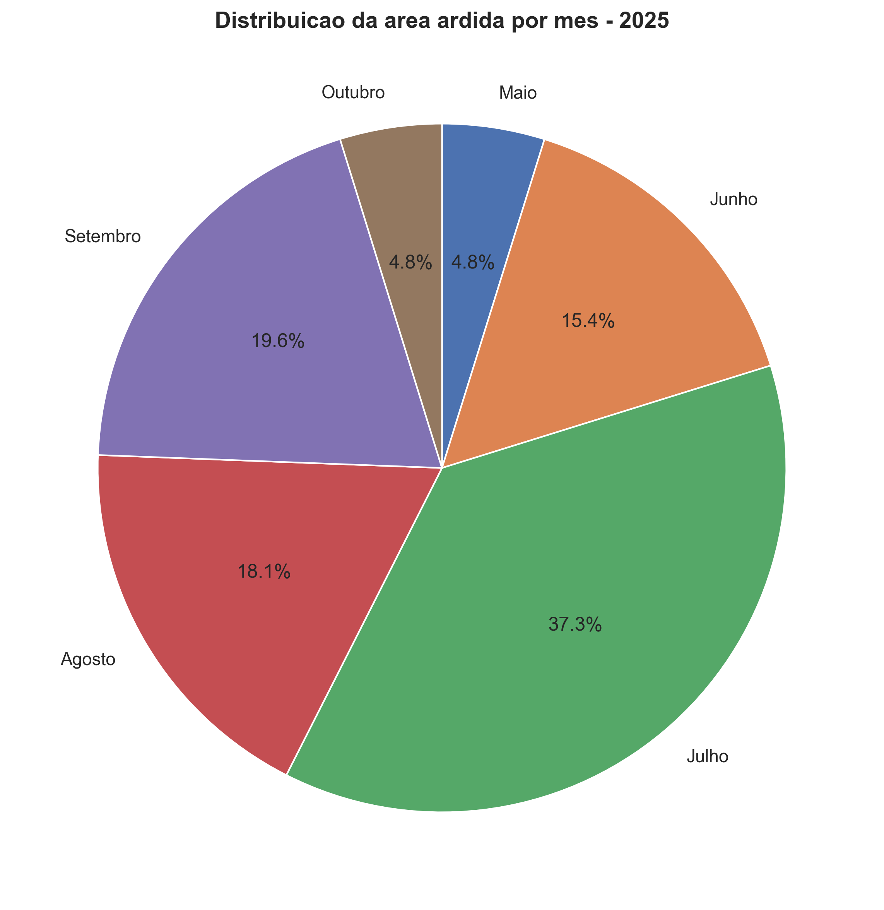

---

6) 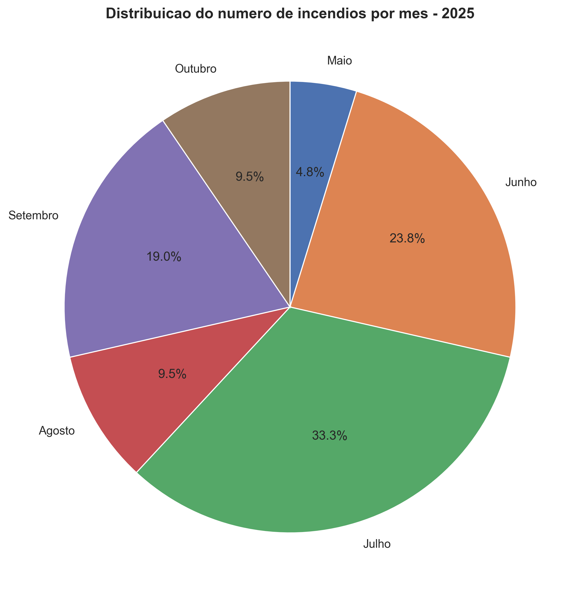

O gráfico circular apresenta a distribuição percentual do número de incêndios florestais por mês em 2025, 
evidenciando maior concentração de ocorrências durante os meses mais quentes do período analisado.

---

7)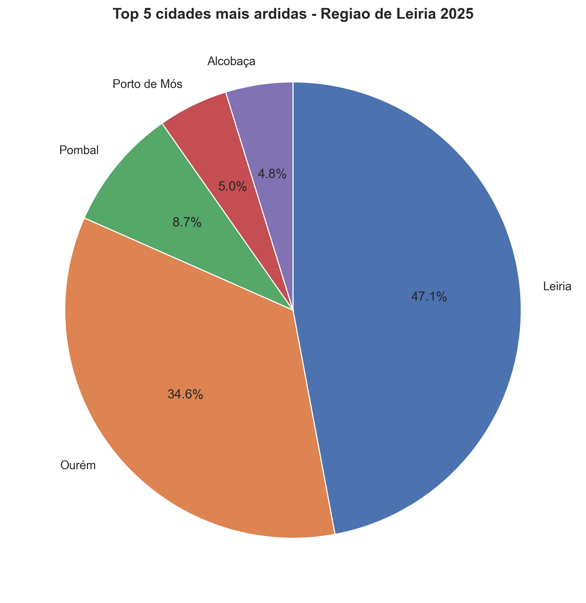

O gráfico apresenta os cinco municípios com maior área ardida em 2025, permitindo identificar as regiões 
mais afetadas pelos incêndios florestais durante o período analisado.

---

8) 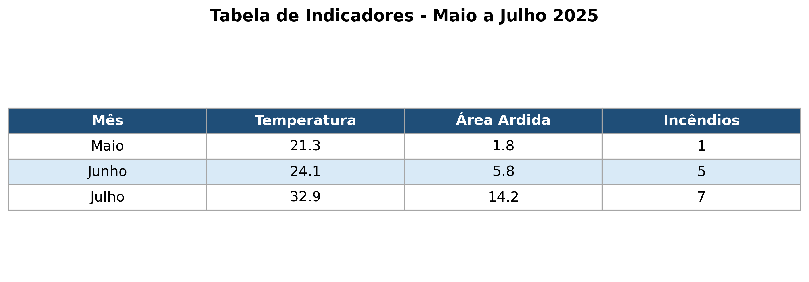

A tabela consolidada apresenta os principais indicadores utilizados na análise exploratória, 
incluindo temperatura, área ardida e número de incêndios florestais. O destaque dado ao mês de Julho 
deve-se ao facto de este ter registado os valores mais elevados de temperatura e maior número de ocorrências 
de incêndios durante o período analisado, sendo identificado como o mês mais crítico da análise.

---

9) 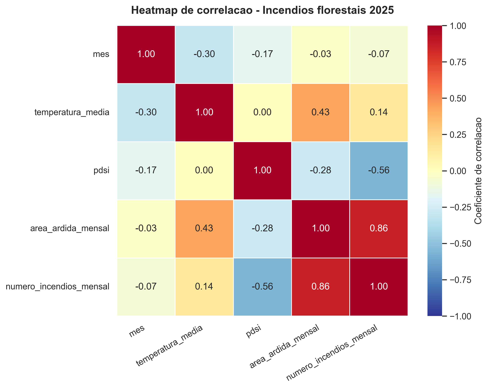 

Durante o desenvolvimento da análise, verificou-se que os dados relativos à velocidade do vento e 
humidade relativa do ar apresentavam limitações de disponibilidade e consistência temporal para o período estudado. 
Por esse motivo, a abordagem analítica foi ajustada, priorizando variáveis com maior robustez e continuidade de dados, 
como temperatura média, área ardida e número de incêndios florestais.
  

Legenda: <b>PDSI</b> (Palmer Drought Severity Index): índice climatológico utilizado para avaliar a severidade da seca 
e disponibilidade hídrica no solo, amplamente utilizado por entidades meteorológicas como o IPMA.

---

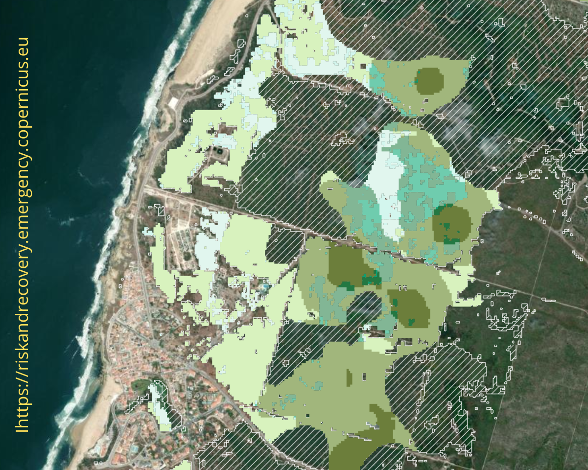 

A imagem Copernicus evidencia a dimensão do impacto provocado pela tempestade, demonstrando extensas áreas afetadas 
pela queda de árvores e acumulação de biomassa seca no terreno. A presença significativa de madeira caída e vegetação 
danificada representa um potencial fator de risco para a propagação de incêndios florestais, especialmente durante os 
períodos de temperaturas elevadas e baixa humidade.

Este cenário reforça a importância da monitorização ambiental contínua e da implementação de estratégias preventivas de 
gestão florestal, permitindo reduzir a vulnerabilidade do território perante eventos climáticos extremos e incêndios futuros.

Legenda: As cores a verde mais escuro e verde médio, a claro são os tipos de árvores afetadas na tempestade.

## Vídeo de Contextualização Ambiental

[▶️ SIC Notícias – Drone mostra destruição no Pinhal de Leiria](https://www.instagram.com/reel/DULec_RiJLG/)

Legenda: SIC Notícias (Instagram) Imagens de drone

---

## Análise Preditiva e Estratégias Preventivas

Com base nos padrões identificados durante a análise exploratória, propõe-se a criação de um Centro de Inteligência 
Ambiental e Monitorização Territorial, atuando de forma preventiva e integrada ao longo de todo o ano. 
A proposta não pretende substituir entidades já existentes, como Bombeiros, Proteção Civil ou Autoridade 
Nacional de Emergência, mas sim funcionar como estrutura complementar de apoio estratégico e operacional.

Este centro poderia integrar equipas técnicas no terreno, sistemas de monitorização climática, drones de vigilância ambiental 
e análise contínua de dados meteorológicos e florestais. O objetivo seria identificar precocemente riscos associados a tempestades, 
queda de árvores, acumulação de biomassa seca e potenciais focos de incêndio, permitindo uma atuação mais rápida, coordenada e 
preventiva em articulação com as restantes instituições.

## Conclusão

Espera-se que este projeto contribua para uma melhor compreensão da relação entre fenómenos climáticos extremos e o aumento do risco de incêndios florestais no distrito de Leiria e regiões adjacentes. A identificação de padrões climáticos, áreas vulneráveis e fatores críticos poderá apoiar o desenvolvimento de estratégias preventivas mais eficazes, reduzindo impactos ambientais, económicos e sociais.

Desta forma, a análise de dados assume um papel fundamental no apoio à proteção civil, gestão florestal e planeamento sustentável do território, tornando-se igualmente uma ferramenta relevante no suporte à tomada de decisão estratégica, monitorização ambiental e implementação de medidas preventivas de atuação rápida e coordenada.

---

🎓 Contexto Académico

Projeto desenvolvido no âmbito da UFCD Análise Exploratória de Dados (GICD) integrado na formação em Análise de Dados e Visualização exploratória, sob orientação do Professor Albano Afonso. 

